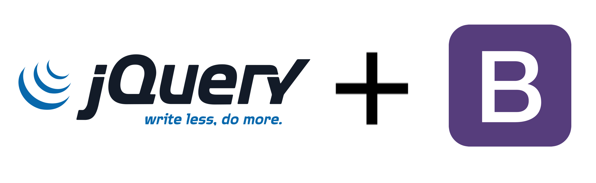

11111111111111111
¿Cuáles son las principales características de Bootstrap que lo hacen ideal para el desarrollo de sitios web responsivos?
¿Cómo facilita Bootstrap la personalización de estilos en comparación con el desarrollo CSS desde cero?
¿Qué es jQuery y cuál es su principal objetivo en el desarrollo web?
¿Por qué se dice que jQuery permite “escribir menos y hacer más”?
