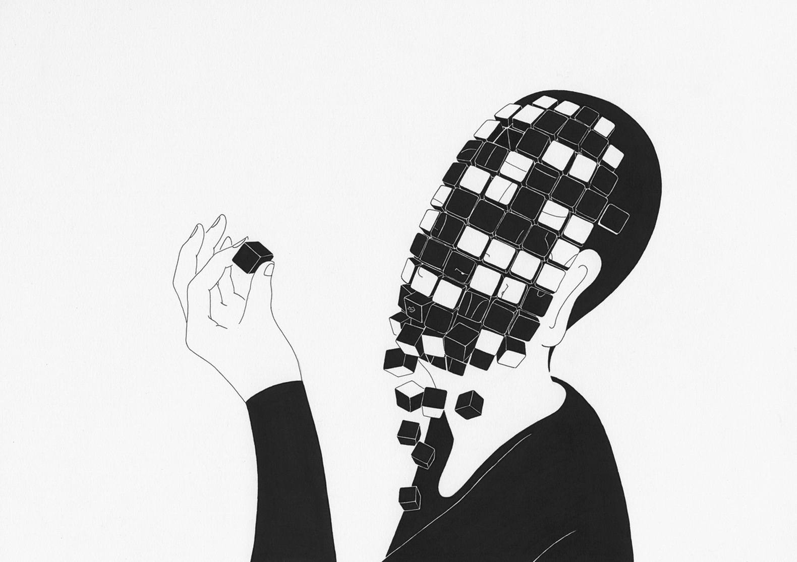

Creo que este tema es importante ya que nos da más herramientas CSS para poder manejar los estilos o tener más control sobre el mismo y poder desenvolvernos de mejor manera. 

La forma en que se relaciona con lo que estudiamos es porque de manera directa picamos código y de manera inmediata vemos qué hace y cómo es que cada valor tiene un efecto en cómo luce la web en la que se trabaja.

## Si no hay preguntas, resume o explica este tema mediante una analogía con tu trabajo anterior o experiencia en casa.

Imagina que estás armando un rompecabezas gigante. El CSS sería como las piezas individuales, con las que puedes darle forma a tu rompecabezas. Bootstrap, por su parte, sería como un set de herramientas que te facilita la tarea, ya que te ofrece piezas prediseñadas que se ajustan perfectamente. Y jQuery sería como un robot que te ayuda a mover las piezas con mayor rapidez y precisión.
En resumen, estas herramientas te ayudan a construir tu rompecabezas web de manera mucho más fácil y rápida, logrando un resultado final más atractivo y funcional.

Digamos que el CSS + Boostrap es un buen mix para manejar los estilos ya que agiliza el proceso de manejo del CSS. POr otro lado, el JQery ayuda a agiizar el uso de JavaScript. COmo dice el lema. escribe menos y haz más.

## Cosas de las que quiero saber más...
De momento me gustaria armar cosas sencillas aplicando CSS + BOostrap y Jquery. Aun da un poco de miedo ya que flexbox puede llegar a ser confuso en algunos momentos, y JavaScript es otro mundo en si mismo. 

Me gustaria crear juegos cortos para romper un tanto el hielo con cosas diferentes.

Me gustaria crear una web de servicios para cuidado de mascotas y servico de baño y grooming

y creacion de software PR. o algo así, esto tengo que preguntarle a Linder. Obvio es un task para cuando tenga los skills más afianzados

**Nota:** No estaba seguro de si escribir esta seccción aquí o crear un nuevo archivo